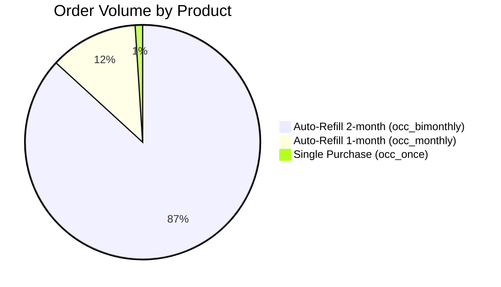
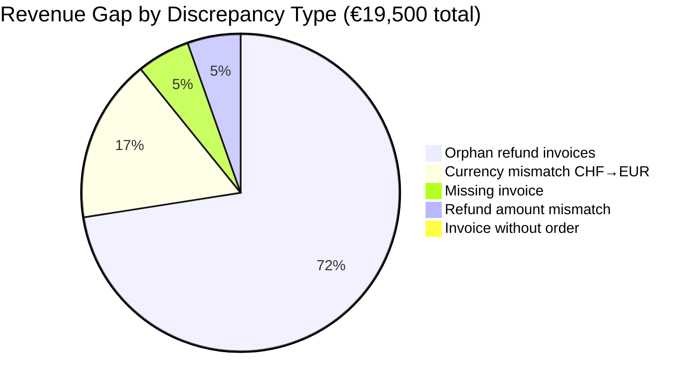
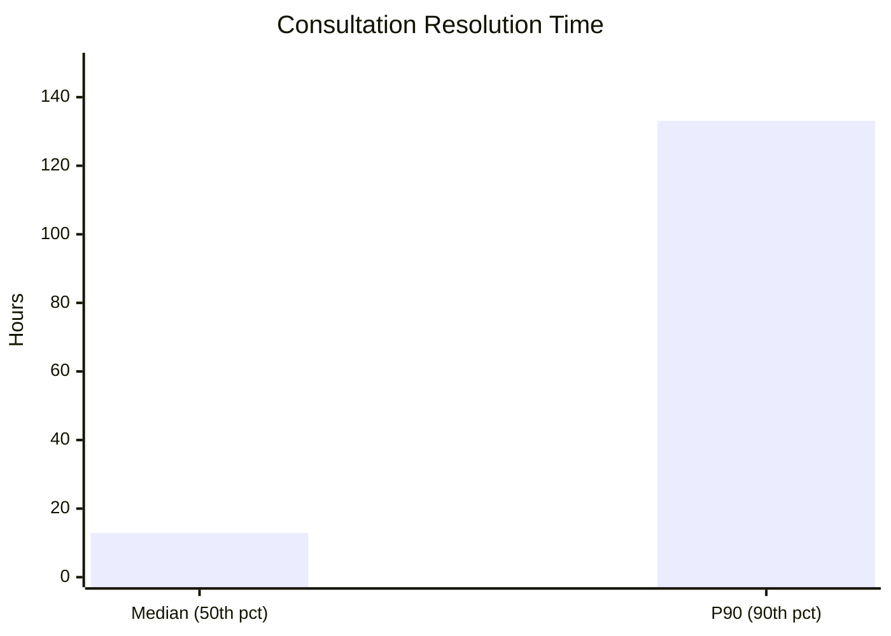
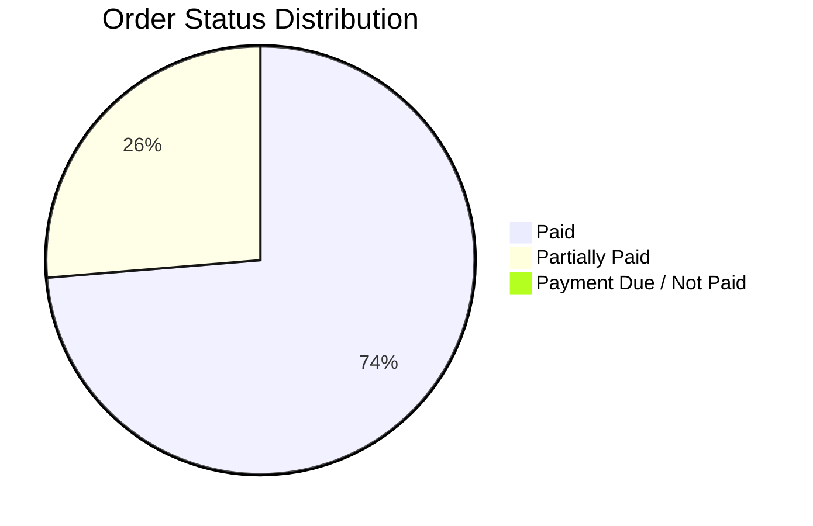
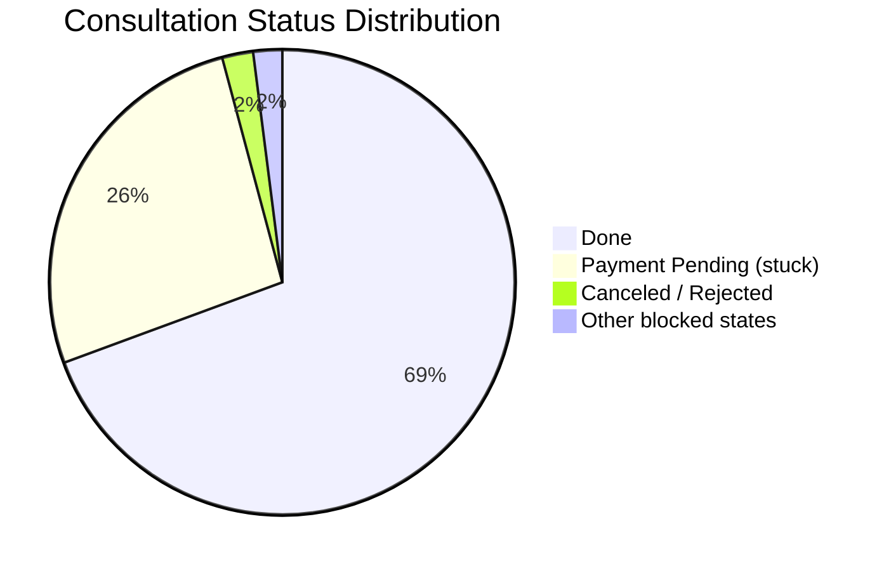
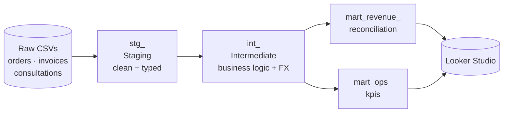

# Formel Skin — Data Analyst Case Study (OPS & Finance)

A take-home case study completed as part of the interview process for the **Data Analyst (OPS & Finance)** role at [Formel Skin](https://www.formel-skin.de), a Berlin-based digital dermatology startup.

The analysis was built entirely in **Google BigQuery** using a dbt-style layered SQL model, with results visualised in **Looker Studio**.

---

## Business Context

Formel Skin operates a subscription-based personalised skincare model. Patients receive prescription-grade treatments prepared by pharmacies, with 4-weekly check-ins and ongoing doctor support. The business runs three product lines:

| Product | Price | Model |
|---|---|---|
| Auto-Refill (1-month set) | €49/month | Subscription |
| Auto-Refill (2-month set) | €44/bi-month | Subscription |
| Single Purchase | €59 one-off | One-time |
| Prescription only | €20 one-off | One-time |

**Order volume by product** (29,464 orders):



---

## Tasks

### Task 1 — Financial Reconciliation

**Problem:** The backend order system showed more revenue than the invoicing system at month-end, creating risks for financial reporting and tax compliance.

**Approach:**
1. Defined revenue consistently across both systems (Order Amount − Refund Amount)
2. Full-joined orders and invoices on `order_id`
3. Classified every row into one of 5 discrepancy types
4. Quantified the gap in EUR with currency normalisation (CHF → EUR)
5. Built an automated daily reconciliation mart model

**Key Findings:**

| Discrepancy Type | EUR Impact | Share |
|---|---|---|
| Refund without order (orphan refund invoices) | €16,100 | 72% |
| Currency mismatch (CHF orders invoiced in EUR) | €3,700 | 16% |
| Missing invoice (paid orders with no invoice) | €1,200 | 5% |
| Refund amount mismatch | €1,200 | 5% |
| Invoice without order | €163 | <1% |
| **Total gap** | **€19,500** | **0.9% of net revenue** |



**Process Improvements Recommended:**
- Capture `refund_date` in the Orders system to align revenue recognition periods
- Automated red-flag report: flag paid orders with no invoice within 2 days (focus on `occ_once` products)
- Enforce currency consistency rule: invoice currency must match order currency

---

### Task 2 — Operations Performance Dashboard

**Problem:** The ops team had no structured visibility — decisions were driven by gut feel and ad-hoc Excel exports while customer complaints about delivery times were rising.

**Approach:** Defined a metrics tree with a North Star KPI, built an atomic mart table, and surfaced results in Looker Studio.

**Metrics Tree:**

| Domain | KPI | Formula |
|---|---|---|
| **North Star** | On-time case resolution rate | % consultations resolved within 72h |
| Order Fulfillment | Order completion rate | Paid orders / Total orders |
| Order Fulfillment | Partial payment rate | Partially paid / Total orders |
| Order Fulfillment | Payment collection lag | Median & P90 days to payment |
| Consultation Ops | Consultation resolution rate | Resolved / Total consultations |
| Consultation Ops | Resolution time SLA | Median & P90 calendar hours |
| Fulfillment Quality | Stuck queue rate | Stuck consultations / Total |
| Fulfillment Quality | Repeat contact rate | Orders with ≥3 consultations / Total |
| Team Capacity | Assignee load | Consultations, resolution rate & stuck rate per assignee |

**Key Insights:**
- Median resolution time is 12.8h — looks fine, but **P90 is 134h** (5+ days): 1 in 10 patients waits over 5 days
- **27.4% of consultations are stuck**, of which 97% are payment-blocked — a revenue risk, not just an ops failure
- **5% of orders have 3+ consultations**, consuming 3× the ops resource with highest churn probability

**Resolution time: the long tail problem**



**Order status breakdown** (29,464 orders):



**Consultation status — stuck queue is a top priority** (97,415 total):



---

## Data Model (dbt-style layers)

```
datasets/
├── orders.csv              ← Internal order system
├── invoices.csv            ← Invoicing system
└── consultations.csv       ← Ops support tickets

sql/
├── staging/                ← Raw → clean, renamed columns, typed
│   ├── 1_stg_orders.sql
│   ├── 1_stg_invoices.sql
│   ├── 1_stg_consultations.sql
│   └── 1_stg_customers.sql
│
├── intermediate/           ← Business logic, flags, EUR normalisation
│   ├── 2_int_orders.sql
│   ├── 2_int_invoices.sql
│   ├── 2_int_invoices_aggregated.sql
│   └── 2_int_consultations.sql
│
└── mart/                   ← Analysis-ready, BI-facing
    ├── 4_mart_revenue_reconciliation.sql   ← Task 1
    └── 4_mart_ops_kpis.sql                 ← Task 2
```

**Pipeline flow:**



---

## Dashboards

| Dashboard | Link |
|---|---|
| Ops Performance + Revenue Reconciliation | [Looker Studio](https://datastudio.google.com/u/7/reporting/37c2f4f9-ad64-4e6e-9db6-91b89b32c93a/page/ShUuF) |

---

## Tools Used

- **Google BigQuery** — SQL execution and table management
- **SQL** — dbt-style layered data modelling (staging → intermediate → mart)
- **Looker Studio** — Dashboard and red-flag reporting
- **Google Slides** — Presentation

---

## Files

| File | Description |
|---|---|
| `problem_statement.pdf` | Original case study brief from Formel Skin |
| `presentation.pdf` | Final presentation delivered to the interview panel |
| `datasets/` | Raw CSV data (orders, invoices, consultations) |
| `sql/staging/` | Staging layer — column renaming, type casting, surrogate keys |
| `sql/intermediate/` | Intermediate layer — business logic, EUR FX normalisation, flags |
| `sql/mart/` | Mart layer — reconciliation model and ops KPI mart |
